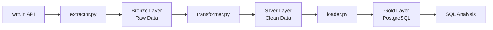

# 🌦️ Weather Data Pipeline (Medallion Architecture)

## 📌 Overview

This project implements a scalable ETL pipeline designed to ingest, process, and store weather data from multiple Brazilian cities.

The pipeline follows the **Medallion Architecture (Bronze → Silver → Gold)**, transforming raw API data into high-quality, analytics-ready datasets stored in PostgreSQL.

---

## 🎯 Objective

Design and implement a robust data pipeline to transform raw weather data into structured and reliable information, enabling:

- Historical data tracking
- Data consistency and quality
- Analytical querying
- Anomaly detection

---

## 🏗️ Architecture Diagram



---

## 🏗️ Architecture

- **Bronze (Raw Layer)**
  Stores raw data collected directly from the wttr.in API without transformations.

- **Silver (Clean Layer)**
  Applies data cleaning, type conversion, outlier removal, and standardization.

- **Gold (Analytics Layer)**
  Stores structured and aggregated data optimized for querying and analysis.

---

## 🔄 Pipeline Flow

1. Extract weather data from wttr.in API (5 Brazilian cities)
2. Store raw data in Bronze layer
3. Transform and clean data in Silver layer (null handling, type validation, IQR outlier removal)
4. Load structured data into PostgreSQL with Incremental Load (no duplicates)
5. Refresh Gold layer aggregations (`clima_analitico` table)
6. Perform analysis using SQL queries

---

## ⚙️ Tech Stack

- Python 3.11+
- Pandas
- PostgreSQL
- SQLAlchemy
- psycopg2
- python-dotenv
- requests
- Git

---

## 📊 Data Model

### Silver — `clima_cidades`

| Column | Type | Description |
|---|---|---|
| id | SERIAL | Primary key |
| cidade | VARCHAR | City name |
| temperatura_c | FLOAT | Temperature (°C) |
| sensacao_termica_c | FLOAT | Feels like (°C) |
| umidade_pct | FLOAT | Humidity (%) |
| descricao | VARCHAR | Weather description |
| vento_kmh | FLOAT | Wind speed (km/h) |
| extraido_em | TIMESTAMP | Extraction timestamp |
| processado_em | TIMESTAMP | Processing timestamp |
| source | VARCHAR | Data source (`wttr_api`) |
| ingestion_time | TIMESTAMP | Ingestion timestamp |

### Gold — `clima_analitico`

| Column | Type | Description |
|---|---|---|
| cidade | VARCHAR | City name |
| temp_media_c | FLOAT | Average temperature |
| temp_max_c | FLOAT | Max temperature |
| temp_min_c | FLOAT | Min temperature |
| umidade_media | FLOAT | Average humidity |
| total_registros | INTEGER | Total records |
| atualizado_em | TIMESTAMP | Last update |

---

## ⚡ Key Features

- Modular ETL pipeline (extract → transform → load)
- Medallion Architecture implementation
- Incremental Load — avoids duplicates via `UNIQUE (cidade, extraido_em)`
- Data quality validation (null handling, type checks, IQR outlier removal)
- Structured logging with file output (`pipeline_clima.log`)
- Full error handling across all pipeline stages
- Metadata tracking (`source`, `ingestion_time`)
- Automated scheduling via Windows Task Scheduler (runs every hour)

---

## 🧪 Data Quality

The pipeline ensures data reliability through:

- Handling missing values (`dropna` on critical columns)
- Type validation (`pd.to_numeric` with error coercion)
- Outlier filtering using the IQR (Interquartile Range) method

---

## 📁 Project Structure

```
pipeline-clima-brasil/
│
├── bronze/
│   └── extractor.py         # Data extraction from wttr.in API
│
├── silver/
│   └── transformer.py       # Data cleaning and quality checks
│
├── gold/
│   └── loader.py            # Database loading + Gold layer aggregations
│
├── src/
│   ├── main.py              # Pipeline entry point
│   └── analises.sql         # SQL analytical queries
│
├── agendar_pipeline.ps1     # Windows Task Scheduler setup
├── requirements.txt
├── pipeline_clima.log       # Execution log (auto-generated)
├── .env                     # Environment variables (not versioned)
├── .gitignore
└── README.md
```

---

## 🚀 How to Run

### 1. Clone the repository

```bash
git clone https://github.com/DataKleber/pipeline-clima-brasil.git
cd pipeline-clima-brasil
```

### 2. Create and activate virtual environment

```bash
python -m venv venv
venv\Scripts\activate  # Windows
```

### 3. Install dependencies

```bash
pip install -r requirements.txt
```

### 4. Configure environment variables

Create a `.env` file in the root:

```env
DB_HOST=your_host
DB_PORT=5432
DB_NAME=your_database
DB_USER=your_user
DB_PASSWORD=your_password
```

### 5. Run the pipeline

```bash
python src/main.py
```

### 6. Schedule automatic execution (Windows)

Run as Administrator:

```powershell
& "c:\path\to\pipeline-clima-brasil\agendar_pipeline.ps1"
```

---

## ⏰ Scheduling

The pipeline runs automatically every hour via **Windows Task Scheduler**.

To schedule manually on Linux/Mac:

```bash
crontab -e
# Add:
0 * * * * /path/to/venv/bin/python /path/to/src/main.py
```

---

## 📈 Future Improvements

- Workflow orchestration with Apache Airflow
- Containerization with Docker
- Cloud deployment (AWS or GCP)
- Data partitioning by date
- Integration with BI tools (Power BI / Metabase)
- Monitoring and alerting

---

## 💡 Conclusion

This project demonstrates how to design and implement a structured data pipeline using industry best practices — transforming raw API data into reliable, analytics-ready datasets through a clean Medallion Architecture.
